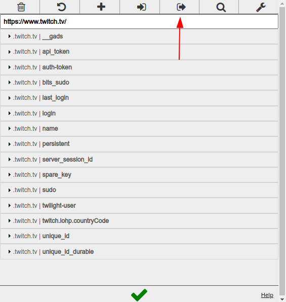

# Relax Lurk

Relax Lurk é um programa que possiblita você dar lurk, ganhar pontos, e apertar o bônus de +50 automaticamente, apenas colocando os cookies do seu navegador.

# Instalação

Para instalar, você precisa do [NodeJS](https://nodejs.org/en/download/) previamente instalado em sua máquina.

Para instalar o Relax Lurk, apenas use `npm install -g relax-lurk` e pronto, já estará instalado.

# Configurando

## Cookies

Você precisar pegar todos os cookies da Twitch do seu navegador, que serão usados para entrar na sua conta como se você estivesse entrando normalmente, sem preencher login por exemplo.

Você pode usar a extensão [Cookie Editor](https://chrome.google.com/webstore/detail/cookie-editor/iphcomljdfghbkdcfndaijbokpgddeno?hl=pt-BR) Disponível para Chrome, entrar na [Twitch](https://twitch.tv), abrir o seu painel, e clicar no botão "Export" para exportar todos os seus cookies da twitch em um JSON.

Pegue todo esse JSON, e copie em um arquivo, com por exemplo, o nome `options.json`, e pronto, agora vamos para a parte do Chrome, e voltaremos neste JSON depois.

## Chrome

Para conseguirmos rodar um navegador, e fazer ele executar tudo que precisamos na live via linha de comando, precisaremos mudar a versão do Chromium que o Puppeteer vai usar, pois o Chromium não tem certos CODECS de vídeo que são usados pela Twitch, logo não irá rodar o vídeo, que é necessário para o Lurk, então, baixe alguma versão do [Chrome, que pode ser baixada aqui](https://www.google.com/intl/pt-BR/chrome/).

E agora você precisa saber onde o Chrome está instalado, em sistemas Linux, o Chrome normalmente está em `/opt/google/chrome/google-chrome`, e este será o executável que você terá que especificar para o Puppeteer saber qual Chrome você deseja.

# Uso

Agora, você pode executar o Relax Lurk usando o comando `relaxlurk`, com todos os argumentos neccessários:

- `stream`: É o canal da twitch que você deseja dar lurk.
- `chrome`: É o caminho do executável do Chrome.
- `cookies`: É o arquivo JSON que contém os cookies que são usados para o login

Exemplo, para dar lurk no canal de fulano, num Linux com o Chrome instalado no lugar padrão, junto com o arquivo de cookies, execute isto:

`relaxlurk --stream fulano --chrome /opt/google/chrome/google-chrome --cookies options.json`

e Pronto! o lurk será iniciado! Agora você pode dormir, relaxar, **trabalhar** ou descansar ajudando o seu streamer favorito.

# Auto-Promoção

Este programa usou a lib Puppeteer, para criar o navegador e executar as rotinas para capturar pontos. Eu também usei o Puppeteer para uma função parecida, no [MarkPDF](https://github.com/edersonferreira/markpdf), que é um programa que transforma Markdown em PDF com bastante personalização, dê uma olhada!
